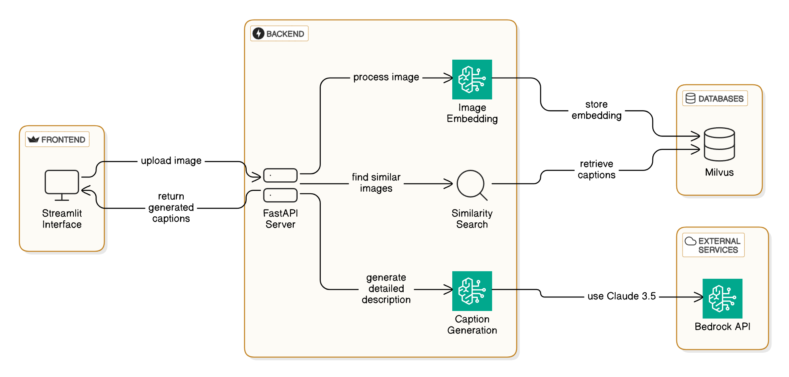

# Medical Image Captioning with RAG and FastAPI-Streamlit Interface
This project provides a medical image captioning solution using a combination of image embeddings, similarity retrieval from Milvus, and text generation models from Bedrock. It leverages a FastAPI backend for processing images and a Streamlit interface for easy user interaction.

## Architecture Diagram


## Model Card


## Project Overview

1. **Image Embedding & Storage**: 
   - Medical images are embedded using Amazon's `titan-embed-image-v1` model from Bedrock and stored in a standalone Milvus database.
   
2. **Similarity Search**:
   - Upon receiving an image from the user, the input image is embedded using the same embedding model. The backend then performs a similarity search in the Milvus database to find similar images and retrieves their captions.
   
3. **Caption Generation**:
   - The retrieved captions are combined with the input image to form a prompt for generating more detailed descriptions using Claude 3.5 (Sonnet) from Bedrock.
   
4. **Frontend (Streamlit)**:
   - A Streamlit interface allows users to upload medical images and receive generated captions based on similarity search and RAG-based description enhancement.

5. **Backend (FastAPI)**:
   - The FastAPI backend handles image embedding, similarity search in Milvus, and communication with the Bedrock API for caption generation.

## Prerequisites

Ensure the following dependencies are installed:

- Docker
- Python 3.8+
- Milvus (Standalone Docker setup)
- AWS account with access to Bedrock
- FastAPI
- Streamlit

## Setup Instructions

### 1. Clone the Repository

Clone the repository to your local machine:

```bash
git clone https://github.com/your-repository/MedImageCaptionRAG.git
cd MedImageCaptionRAG
```

### 2. Set Up Environment Variables

Create a .env file in the root directory and add the necessary environment variables:

```bash
INFERENCE_PROFILE_ID=your_inference_profile_id
S3_BUCKET_NAME=your_s3_bucket_name
```

Make sure to replace your_inference_profile_id and your_s3_bucket_name with your actual Bedrock and S3 details.

### 3. Install Dependencies
Install the required Python libraries by running:

```bash
pip install -r requirements.txt
```

### 4. Running Locally
#### Start FastAPI Backend
Run the FastAPI backend server locally using uvicorn:

```bash
uvicorn api:app --reload
```

The FastAPI server will be running at http://localhost:8000.

#### Start Streamlit Interface
Run the Streamlit app to start the user interface:

```bash
streamlit run app.py
```

The Streamlit interface will be accessible at http://localhost:8080.


### 5. Running with Docker
#### Build and Run FastAPI Docker Container
To build and run the FastAPI container:

```bash
docker build -t api:latest -f Dockerfile_api .
docker run --name fastapi-container --network my_network -p 8181:8181 api:latest
```
This will start the FastAPI backend on http://localhost:8181.

#### Build and Run Streamlit Docker Container
To build and run the Streamlit container:

```bash
docker build -t streamlit:latest -f Dockerfile .
docker run --name streamlit-container --network my_network -p 8080:8080 streamlit:latest
```
This will start the Streamlit interface on http://localhost:8080.

### 6. Test the Application
- Open http://localhost:8080 in your browser to use the Streamlit interface.
- Upload a medical image (JPG/PNG) and click "Generate Caption."
- The application will display the retrieved similar captions, a RAG-enhanced caption, and a classic caption generated using Bedrock.


### Project Structure
The project contains the following files and directories:


```bash
.
├── .env                        # Environment variables
├── .gitignore                  # Git ignore file
├── api.py                       # FastAPI backend
├── app.py                       # Streamlit frontend
├── awsdeploy                   # AWS deployment scripts
├── Dockerfile                  # Dockerfile for Streamlit
├── Dockerfile_api              # Dockerfile for FastAPI
├── LICENSE                     # Project license
├── README.md                   # Project README
├── requirements.txt            # Python dependencies
├── retrieve.py                 # Functions for image retrieval and embedding
├── s3_to_milvus.ipynb          # Jupyter notebook for S3 to Milvus setup
└── testingClaude.ipynb         # Jupyter notebook for testing Claude model
```

### Troubleshooting
- Ensure that your AWS credentials and environment variables are correctly configured.
- Verify that the Milvus instance is up and running, and that the database contains the embedded images and captions.
- If the models fail to respond, check the logs for error details.


### License
This project is licensed under the MIT License - see the LICENSE file for details.